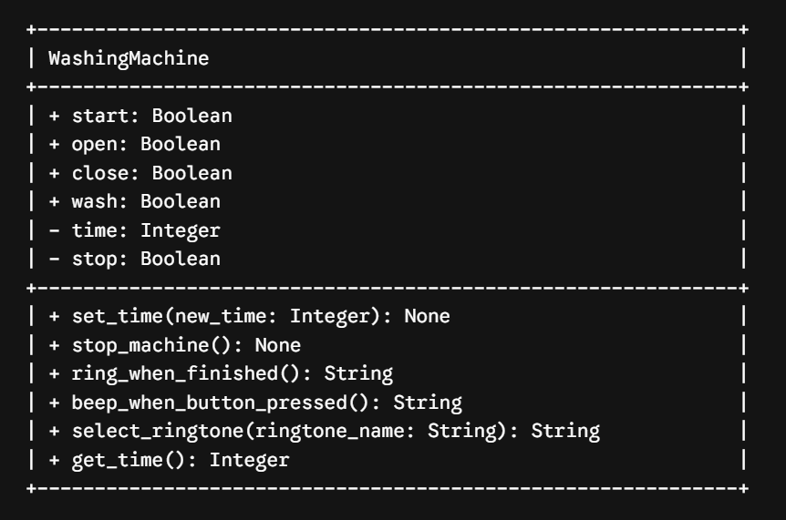
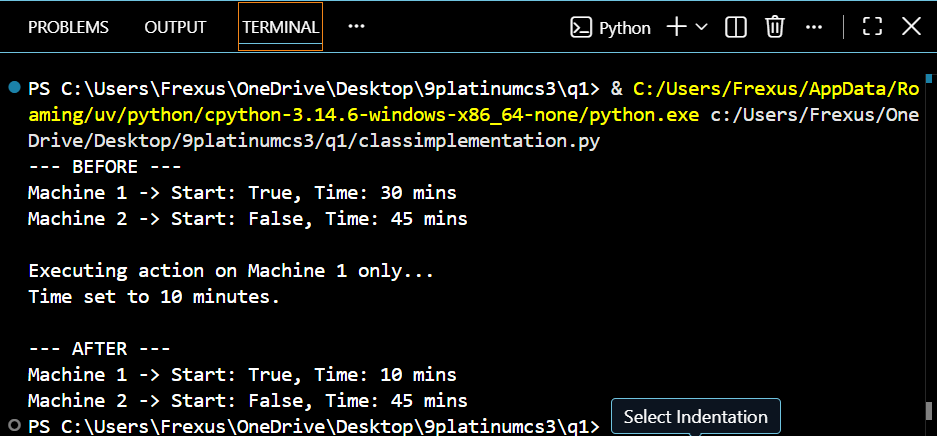
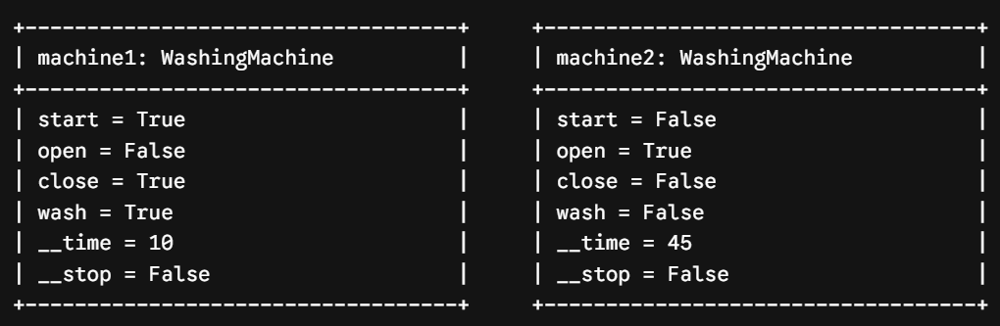

# Class Attributes and Methods

## Previous Design
Link to my previous activity: [classObjectUML.md](classObjectUML.md)

## Design Revision
No major changes were needed from my original design. I retained all my original properties (`start`, `open`, `close`, `wash`, `time`, `stop`) and methods, but assigned visibility modifiers (`+` public, `-` private) to support encapsulation.

## Visibility Decisions
| Attribute | Data Type | Visibility | Reason |
| :--- | :--- | :--- | :--- |
| open | Boolean | Public | Physical door state accessible to users |
| close | Boolean | Public | Indicates if door is closed |
| start | Boolean | Public | Master power toggle |
| wash | Boolean | Public | Washing mode indicator |
| __time | Integer | Private | Protects timer countdown from external corruption |
| __stop | Boolean | Private | Protected internal flag to safely stop machine |

## Updated UML Class Diagram

## Python Implementation
[View Python Source](classimplementation.py)

## Test Run

## Object Diagram

## Analysis
### Why did you make your chosen attribute private?
I made `__time` and `__stop` private attributes to protect internal timer state and stop mechanisms from unwanted external modifications. If outside code changed `__time` directly, it could skip cycle execution or set impossible negative values. Encapsulating `__time` forces changes to go through the `set_time()` method, which checks for valid inputs before updating.

### Which method changes the state of your object?
The `set_time()` method changes the state of the object by updating the private `__time` attribute using the passed parameter. Furthermore, the `stop_machine()` method alters the private `__stop` flag to `True` and turns `start` to `False`. These methods allow the object state to update safely according to pre-defined rules.

### How did your two objects demonstrate that instances are independent?
My test output proved object independence because calling `set_time(10)` on `machine1` updated its timer to 10 minutes while `machine2` remained at 45 minutes. Even though both objects originated from the same `WashingMachine` blueprint, altering instance 1 had zero effect on instance 2. This confirms each object maintains its own distinct memory block and attribute values.

### What is the difference between your class diagram and your object diagram?
The class diagram acts as an abstract template defining all possible attributes, data types, and method signatures available to any `WashingMachine` instance. The object diagram captures concrete instances (`machine1` and `machine2`) at a specific moment in runtime, displaying real active data values like `__time = 10`. In short, the class diagram shows structural rules, while the object diagram shows actual runtime states.